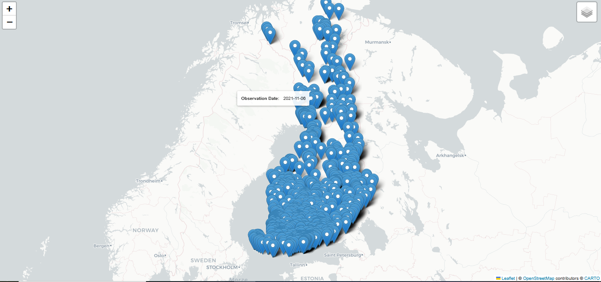
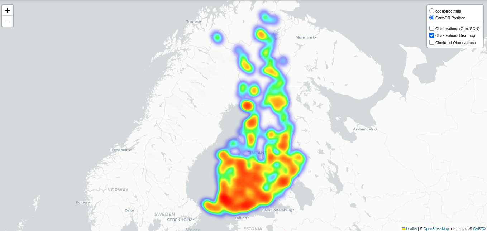
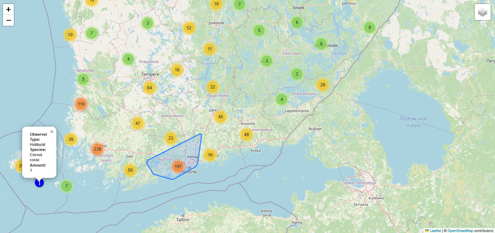

[EN]
_______
<b> Exercise 3 - creating an interactive map showing where the common raven can be seen in Finland in 2021 using Jupyter Notebook.</b>
- The first layer contains markers with a tooltip with the date of observation.

- The second layer contains a heat map of the number of birds observed.

- The third layer contains grouped markers with a description of the observer type and the number of birds observed, with different colored icons depending on the observer type, and different icons depending on whether one or more birds were observed.

[PL]
________
<b> Ćwiczenie 3 — stworzenie interaktywnej mapy pokazującej, gdzie w Finlandii w 2021 r. zaobserwowano kruka zwyczajnego, przy użyciu Jupyter Notebook i według poniższych wytycznych.</b>
- Pierwsza warstwa ma zawierać znaczniki z etykietą narzędzia z datą obserwacji.

- Druga warstwa ma zawierać mapę cieplną liczby zaobserwowanych ptaków.

- Trzecia warstwa ma zawierać zgrupowane znaczniki z opisem typu obserwatora i liczby zaobserwowanych ptaków, z różnymi kolorowymi ikonami w zależności od typu obserwatora i różnymi ikonami w zależności od tego, czy zaobserwowano jednego czy więcej ptaków.

